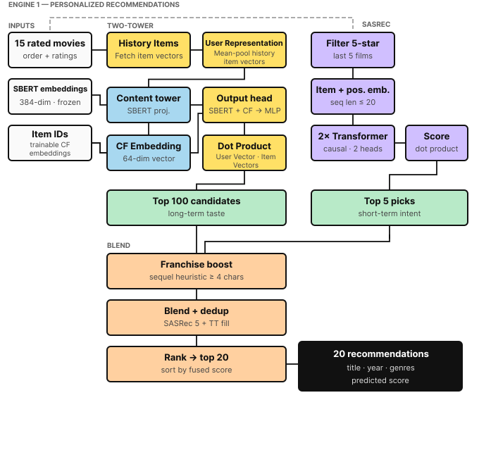
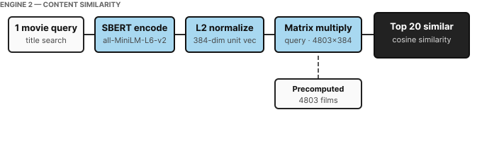

# Hybrid Movie Recommender System: Two-Tower Retrieval, SASRec Sequential Ranking, and Semantic Similarity Search

A full-stack machine learning project that implements two distinct recommendation engines served through a unified web application — a **personalized hybrid deep learning pipeline** trained on 25 million ratings, and a **semantic content similarity engine** for instant item-to-item retrieval. The system is built entirely locally with no external database; all model weights, embeddings, and metadata live in memory after server startup.

## Key Features

* **Hybrid Two-Stage Pipeline:** Utilizes a Two-Tower architecture for long-term candidate generation (Stage 1) and a SASRec (Transformer-based) model for short-term sequential ranking (Stage 2).
* **Semantic Content Search:** Generates and caches dense text embeddings to power semantic, item-to-item similarity recommendations.
* **Large-Scale Training:** Trained and evaluated on the MovieLens 25M dataset.
* **Local, In-Memory Serving:** Designed for fast inference by loading models and cached embeddings directly into memory, requiring zero external database dependencies.
* **Real-Time Inference:** Generates personalized recommendations on the fly (Note: Model weights are static and do not utilize online learning/real-time feedback loops).


---
<h2>Engine 1 – Personalized Recommendations</h2>

<p align="center">
  
</p>

<h2>Engine 2 – Semantic Similarity Search</h2>

<p align="center">
  
</p>

---


## Table of Contents

1. [Project Overview](#1-project-overview)
2. [System Components](#2-system-components)
3. [Software Architecture](#3-software-architecture)
   - 3.1 [Frontend](#31-frontend)
   - 3.2 [Backend](#32-backend)
   - 3.3 [Inference Bundle Pattern](#33-inference-bundle-pattern)
   - 3.4 [Data Flow](#34-data-flow)
   - 3.5 [Project Directory Structure](#35-project-directory-structure)
   - 3.6 [Running the System](#36-running-the-system)
4. [Engine 1 — Personalized Recommendation Engine](#4-engine-1--personalized-recommendation-engine)
   - 4.1 [Datasets](#41-datasets)
   - 4.2 [System Architecture at a Glance](#42-system-architecture-at-a-glance)
   - 4.3 [Data Preparation: Two-Tower Pipeline](#43-data-preparation-two-tower-pipeline)
   - 4.4 [Data Preparation: Sequential Pipeline](#44-data-preparation-sequential-pipeline)
   - 4.5 [Model Architecture: History-Based Two-Tower Network](#45-model-architecture-history-based-two-tower-network)
   - 4.6 [Model Architecture: SASRec](#46-model-architecture-sasrec-self-attentive-sequential-recommender)
   - 4.7 [The Two-Stage Recommendation Pipeline (Inference)](#47-the-two-stage-recommendation-pipeline-inference)
   - 4.8 [Model Loading: Lazy Singleton Pattern](#48-model-loading-lazy-singleton-pattern)
   - 4.9 [Supporting Utilities](#49-supporting-utilities)
   - 4.10 [Key Design Decisions and Trade-offs](#410-key-design-decisions-and-trade-offs)
   - 4.11 [Complete Data and Model Flow Diagram](#411-complete-data-and-model-flow-diagram)
   - 4.12 [Hyperparameters and Configuration Summary](#412-hyperparameters-and-configuration-summary)
5. [Engine 2 — Content-Based Similarity Engine](#5-engine-2--content-based-similarity-engine)
   - 5.1 [Dataset](#51-dataset)
   - 5.2 [System Architecture at a Glance](#52-system-architecture-at-a-glance)
   - 5.3 [Data Preparation Pipeline](#53-data-preparation-pipeline)
   - 5.4 [The Similarity Engine: Design and Mathematics](#54-the-similarity-engine-design-and-mathematics)
   - 5.5 [Production Inference Module](#55-production-inference-module)
   - 5.6 [Supporting Utilities](#56-supporting-utilities)
   - 5.7 [Empirical Similarity Results](#57-empirical-similarity-results)
   - 5.8 [Key Design Decisions and Trade-offs](#58-key-design-decisions-and-trade-offs)
   - 5.9 [Configuration and Artifact Summary](#59-configuration-and-artifact-summary)
6. [Engine Comparison](#6-engine-comparison)

---

## 1. Project Overview

This system serves three distinct machine learning models through a unified interface. A user can either provide 15 explicit movie ratings to receive a deeply personalized ranked list from a two-stage deep learning pipeline, or search for any single movie to discover semantically similar films. The two recommendation approaches are architecturally independent and complementary — together they cover both "what should *I* watch next?" and "what is *similar to this*?"

**Tech stack at a glance:**

| Layer | Technology |
|-------|-----------|
| Frontend | Next.js 14 (App Router), TypeScript, Tailwind CSS, Axios |
| Backend | Django 4.x, Django REST Framework, Python 3.12 |
| Personalization | PyTorch — Two-Tower Network + SASRec Transformer |
| Similarity | NumPy — SBERT embeddings (no query-time ML) |
| Data | MovieLens 25M (~25M ratings), TMDB 5000 |
| Serving | All inference in-memory; no database reads at runtime |

---

## 2. System Components

The system exposes three separate ML-backed endpoints:

| Endpoint | Engine | Description |
|----------|--------|-------------|
| `POST /api/v2/recommend/` | Two-Tower + SASRec | Personalized recommendations from 15 ratings |
| `GET /api/tmdb/similar/` | SBERT Similarity | Content-based similarity for a given movie |
| `GET /api/v2/movies/` | In-memory search | Title search over the 25M model's vocabulary |

Each model is packaged into a self-contained `.pkl` inference bundle and loaded once at first request via a lazy singleton, remaining in RAM for all subsequent calls.

---

## 3. Software Architecture

### 3.1 Frontend

**Framework:** Next.js 14 (App Router) · **Language:** TypeScript · **Styling:** Tailwind CSS · **HTTP client:** Axios

The frontend is organised under `frontend/app/` using file-system routing. Each route is a React Server Component shell with a `'use client'` page component that handles all interaction.

**Pages and their roles:**

`/rate` — the primary rating page. The user fills in demographics (gender, age group, occupation), searches for movies by title using a debounced live search, adds 15 to a rated list with star ratings, and submits. On submission, the 15 rated movies and demographics are sent to `/api/recommend/`. The response array is stored in `sessionStorage` and the user is navigated to `/recommendations`.

`/rate-new` — identical layout to `/rate` but with no demographics panel. Searches against the 25M model's movie vocabulary via `/api/v2/movies/` and submits to `/api/v2/recommend/`. Results are stored under the same `sessionStorage` key so the same recommendations page handles both models.

`/recommendations` — reads the recommendations array from `sessionStorage` and renders a ranked list. The score bar normalises within the result set rather than against the 1–5 scale, so differences between closely ranked movies are visually meaningful. Each item shows title, year, genres, and a 6-decimal predicted score.

`/similar` — TMDB-based content similarity search. A search input with a live autocomplete dropdown calls `/api/tmdb/search/`. Selecting a suggestion or pressing Enter calls `/api/tmdb/similar/` and renders ranked results with cosine similarity percentages.

**API layer:** All backend calls are centralised in `frontend/lib/api.ts`. An Axios instance is created with `baseURL: http://localhost:8000/api`. Each model has its own set of typed functions:

```
searchMovies()          → GET /api/movies/?q=
getRecommendations()    → POST /api/recommend/
searchMovies25m()       → GET /api/v2/movies/?q=
getRecommendations25m() → POST /api/v2/recommend/
searchMoviesTMDB()      → GET /api/tmdb/search/?q=
getSimilarTMDB()        → GET /api/tmdb/similar/?q=
```

TypeScript interfaces (`Movie`, `RatedMovie`, `Recommendation`, `Demographics`, `SimilarMoviesResult`) enforce the shape of every request and response at compile time.

### 3.2 Backend

**Framework:** Django 4.x with Django REST Framework · **Language:** Python 3.12 · **Serving:** `manage.py runserver 8000`

The backend is a single Django app called `recommender` inside `movie_api/`. There is no database — Django's default SQLite exists only for internal session/auth tables and is never read or written by recommender logic.

**URL routing:**

```
movie_api/config/urls.py
  └── /api/  →  recommender/urls.py
                  ├── movies/          →  movies_list
                  ├── recommend/       →  recommend
                  ├── similar/         →  similar_movies
                  ├── v2/movies/       →  movies_list_25m
                  ├── v2/recommend/    →  recommend_25m
                  ├── tmdb/search/     →  tmdb_search
                  └── tmdb/similar/    →  tmdb_similar
```

Each view is a plain function decorated with `@api_view`. Views do no ML work directly — they validate the request, call the appropriate inference module, and return a `Response`.

**CORS:** `django-cors-headers` is installed with `CORS_ALLOW_ALL_ORIGINS = True` for local development. `CorsMiddleware` must be the first entry in `MIDDLEWARE`.

### 3.3 Inference Bundle Pattern

Each model is packaged into a single `.pkl` file containing everything needed for inference: model weights, architecture config, ID mappings, feature matrices, and movie metadata. No notebooks, raw data files, or training-codebase imports are needed at serve time.

| Bundle | Path | Size |
|--------|------|------|
| ML-1M model | `data/inference/inference_bundle.pkl` | ~45 MB |
| ML-25M model | `data/inference_25m/inference_bundle_25m.pkl` | ~415 MB |
| TMDB similarity | `data/inference_tmdb/inference_bundle_tmdb.pkl` | ~9 MB |

Each inference module (`inference.py`, `inference_25m.py`, `inference_tmdb.py`) uses a module-level singleton. On the first request, `_load()` opens the pickle, reconstructs the PyTorch model from the stored state dict, moves it to the appropriate device, and stores references in module-level globals. All subsequent requests reuse the already-loaded objects.

### 3.4 Data Flow

```
User browser
  │
  │  search query (keypress → 250ms debounce)
  ▼
Next.js (port 3000)
  │
  │  GET /api/movies/?q=spider
  ▼
Django REST API (port 8000)
  │
  │  inference module .search_movies("spider")
  │  → filters in-memory movies_meta DataFrame
  │  → returns [{movie_id, title, year, genres}, ...]
  ▼
Next.js renders dropdown

  │  user selects 15 movies, adjusts stars, submits
  ▼
  │  POST /api/recommend/ {demographics, ratings}
  ▼
Django REST API
  │
  │  inference module .recommend(demographics, ratings)
  │  → load bundle (cached after first call)
  │  → encode context → run two models → blend → return top 20
  ▼
Next.js stores results in sessionStorage → navigates to /recommendations
  │
  ▼
/recommendations page reads sessionStorage → renders ranked list
```

### 3.5 Project Directory Structure

```
project_root/
├── data/
│   ├── ml-1m/                    raw MovieLens 1M data
│   ├── ml-25m/                   raw MovieLens 25M data
│   ├── tmdb-5000/                raw TMDB 5000 data
│   ├── working/                  Data Prep artifacts (1M model)
│   ├── working_25m/              Data Prep artifacts (25M model)
│   ├── working_tmdb/             Data Prep artifacts (TMDB similarity)
│   ├── inference/
│   │   └── inference_bundle.pkl
│   ├── inference_25m/
│   │   └── inference_bundle_25m.pkl
│   └── inference_tmdb/
│       └── inference_bundle_tmdb.pkl
│
├── ML/
│   ├── Data_Prep.ipynb           1M model data preparation
│   ├── Model_Training.ipynb      1M model training
│   ├── Data_Prep_25M.ipynb       25M model data preparation
│   ├── Model_Training_25M.ipynb  25M model training
│   ├── Data_Prep_TMDB.ipynb      TMDB similarity data preparation
│   └── Model_Training_TMDB.ipynb TMDB similarity embedding + bundle
│
├── movie_api/                    Django backend
│   ├── config/
│   │   ├── settings.py
│   │   └── urls.py
│   └── recommender/
│       ├── views.py              REST endpoints
│       ├── urls.py               URL patterns
│       ├── inference.py          1M model inference singleton
│       ├── inference_25m.py      25M model inference singleton
│       ├── inference_tmdb.py     TMDB similarity inference singleton
│       └── ml/
│           └── predictor.py      1M model class definitions
│
└── frontend/                     Next.js frontend
    ├── app/
    │   ├── rate/page.tsx         1M model rating page
    │   ├── rate-new/page.tsx     25M model rating page
    │   ├── recommendations/page.tsx  results page
    │   └── similar/page.tsx      TMDB similarity page
    └── lib/
        └── api.ts                typed API functions
```

### 3.6 Running the System

Two terminal windows are required:

**Terminal 1 — Django API:**
```bash
cd movie_api
python manage.py runserver 8000
```

**Terminal 2 — Next.js frontend:**
```bash
cd frontend
npm run dev
```

The application is then available at `http://localhost:3000`. The 25M bundle (~415 MB) takes a few seconds on first request; all subsequent requests are fast because models stay in RAM.

---

## 4. Engine 1 — Personalized Recommendation Engine

### Technical Report — Two-Tower Candidate Generation with SASRec Sequential Re-Ranking

This engine takes a user's 15 explicit movie ratings and returns a ranked list of personalized recommendations. It implements an industry-standard **two-stage retrieval-and-ranking pipeline** combining two complementary deep learning models:

- **Stage 1 — History-Based Two-Tower Network**: A content-aware collaborative filtering model that understands a user's *general, long-term taste* based on their entire rating history. It rapidly narrows the full catalog (~10,000+ movies) down to a manageable pool of high-quality candidates.

- **Stage 2 — SASRec (Self-Attentive Sequential Recommender)**: A Transformer-based sequential model that captures the user's *short-term, immediate intent* by analyzing the temporal order of their most recent 5-star interactions. It re-ranks and supplements the Stage 1 pool to surface what the user most likely wants *right now*.

The final output blends signals from both models plus a **franchise/sequel boosting heuristic**, producing a ranked list of up to 20 recommendations that is simultaneously broad (long-term preferences) and contextually sharp (current mood and intent).

---

### 4.1 Datasets

The system is trained and evaluated on two public datasets:

#### MovieLens 25M (`ml-25m`)

The primary interaction dataset. Contains approximately **25 million explicit ratings** from real users of the MovieLens platform.

| File | Content |
|------|---------|
| `ratings.csv` | `userId`, `movieId`, `rating` (0.5–5.0 stars), `timestamp` |
| `movies.csv` | `movieId`, `title`, `genres` (pipe-separated) |
| `links.csv` | `movieId`, `imdbId`, `tmdbId` — cross-reference table |

Raw dataset size: 25,000,095 ratings across 162,541 users and 59,047 movies.

#### TMDB 5000 Movies (`tmdb_5000_movies.csv`)

A supplementary metadata dataset from The Movie Database. Used exclusively to enrich movies with:

- `overview`: A long-form textual synopsis of the film's plot.
- `tagline`: A short marketing tagline.
- `id` (aliased to `tmdbId`): The primary key used to join with MovieLens via the `links.csv` cross-reference.

These text fields are the raw material for generating semantic movie embeddings.

---

### 4.2 System Architecture at a Glance

```
User Input: 15 Movie Ratings
           │
           ├──► [Stage 1] Two-Tower Network
           │         │ Uses liked items as user proxy
           │         │ Scores all ~10K items via dot product
           │         │ Returns top-100 candidates
           │
           ├──► [Stage 2] SASRec Network
           │         │ Uses last five 5-star movies in sequence
           │         │ Predicts next-item logits over 59K items
           │         │ Returns top-5 sequentially-relevant picks
           │
           └──► Blending Logic
                    │ 1. Franchise/Sequel Boost (from last 5-star)
                    │ 2. SASRec Top-5 inserted first
                    │ 3. Two-Tower candidates fill remainder
                    │
                    ▼
              Final Ranked List (top-20 movies)
```

---

### 4.3 Data Preparation: Two-Tower Pipeline

**Notebook:** `Data_Prep_2Tower.ipynb`

This notebook processes raw MovieLens and TMDB data into clean training interaction files and pre-computed semantic embeddings for every movie.

#### 4.3.1 Raw Data Loading

Three MovieLens files are loaded: `ratings.csv`, `movies.csv`, and `links.csv`. The TMDB enrichment file `tmdb_5000_movies.csv` is loaded from a separate path. All loading is done with pandas.

#### 4.3.2 Filtering and Implicit Feedback Construction

The raw 25M ratings are aggressively filtered to ensure data quality:

**Step 1 — Minimum movie popularity filter:**
Only movies with **≥ 100 ratings** are retained. This eliminates long-tail, obscure movies with insufficient interaction signal, reducing noise in collaborative filtering.

**Step 2 — Minimum user activity filter:**
Only users with **≥ 50 ratings** are retained. This ensures every user has a meaningful interaction history for the model to learn from. Cold-start users (few interactions) are excluded from training.

After these two filters:

| Metric | Value |
|--------|-------|
| Positive interactions | 11,158,595 |
| Unique users | 102,128 |
| Unique movies | 10,326 |

**Step 3 — Implicit feedback binarization:**
The system treats recommendations as an **implicit feedback problem**, not an explicit rating prediction problem. A rating of **≥ 4.0 stars is treated as a "like"** (positive signal). All lower ratings are discarded. This produces a clean set of positive interactions without any negative explicit ratings — the model learns from what users *chose to like*, not from predicted star counts.

Only the columns `userId`, `movieId`, and `timestamp` are retained from this point forward.

#### 4.3.3 ID Remapping

Raw MovieLens IDs are non-contiguous integers (e.g., movieId can be 1, 5, 147, 318...). Neural embedding layers require contiguous 0-indexed integer indices. Two mapping dictionaries are created:

```python
user2idx = {original_user_id: contiguous_int}   # 102,128 entries
movie2idx = {original_movie_id: contiguous_int}  # 10,326 entries
```

Both the positive interactions DataFrame and the movie metadata DataFrame are augmented with `user_idx` and `movie_idx` columns using these maps. These dictionaries are saved and are essential for inference — they translate between real-world MovieLens IDs and the model's internal index space.

#### 4.3.4 TMDB Enrichment and Text Feature Engineering

The movie metadata is enriched through a multi-step join:

1. `movies_filtered` (MovieLens titles + genres) is joined with `links.csv` to obtain the `tmdbId` for each movie.
2. Rows missing a `tmdbId` are dropped (a small subset of movies with no TMDB match).
3. The result is joined with the TMDB dataset on `tmdbId` to obtain `overview` and `tagline` fields.
4. Missing text fields are filled with empty strings.

A **rich text feature string** is then constructed for each movie by concatenating three fields:

```
text_feature = title + ". " + tagline + " " + overview
```

This concatenation deliberately puts the movie title first (highest-signal term for retrieval), followed by the punchy tagline, followed by the detailed plot overview. The resulting string gives the sentence encoder a dense, information-rich passage to embed.

After the TMDB join, 5 movies that had no TMDB match are lost, reducing the movie count from 10,326 to **10,321** and removing their interactions. Final cleaned interactions: **11,158,008**.

#### 4.3.5 Sentence Embedding Generation

The `all-MiniLM-L6-v2` model from the `sentence-transformers` library is used to encode every movie's `text_feature` string into a dense semantic vector.

**Why `all-MiniLM-L6-v2`?**
- Output dimensionality: **384 dimensions**
- It is a distilled, lightweight model that runs very fast (particularly important when embedding 10K+ items)
- Despite its small size, it captures rich semantic relationships — two movies about "space colonization" will have similar embeddings even if they share no exact vocabulary
- The model is pre-trained on a massive diverse corpus; its semantic knowledge generalizes well to movie plots

Encoding is performed with `batch_size=256` and a progress bar. The output is a dictionary mapping each `movie_idx` to its 384-dimensional float32 embedding vector.

#### 4.3.6 Saved Artifacts

The following files are saved to `data/processed/`:

| File | Format | Description |
|------|--------|-------------|
| `train_interactions.csv` | CSV | 80% random split of positive interactions (user_idx, movie_idx, timestamp) |
| `val_interactions.csv` | CSV | 20% random split for validation |
| `user2idx.pkl` | Pickle | User ID → contiguous index map |
| `movie2idx.pkl` | Pickle | Movie ID → contiguous index map |
| `movie_embeddings.pkl` | Pickle | Dict: movie_idx → 384-dim numpy array |
| `movie_metadata.csv` | CSV | movie_idx, movieId, title, genres per movie |

The train/val split uses `sklearn`'s `train_test_split` with `random_state=42` and `test_size=0.2`. Note: this is a **random** split at the interaction level (not a user-level or time-based split), which is appropriate for the Two-Tower model's training objective.

---

### 4.4 Data Preparation: Sequential Pipeline

**Notebook:** `Data_Prep_Sequential.ipynb`

This notebook processes the same raw MovieLens data through a fundamentally different pipeline optimized for sequence modeling. The sequential model needs to see *ordered interaction histories*, not just unordered bags of liked items.

#### 4.4.1 Loading and Column Normalization

The raw `ratings.csv` is loaded and columns are renamed to standard names (`userId` → `user_id`, `movieId` → `item_id`) for clarity. All 25,000,095 interactions are loaded — unlike the Two-Tower pipeline, the sequential model uses **all ratings** (not just positives ≥ 4.0), because what a user rated at all (regardless of score) represents a meaningful temporal signal about their browsing behavior.

#### 4.4.2 Filtering and Contiguous Index Mapping

**Minimum interaction filter:**
Users with fewer than `MIN_INTERACTIONS = 5` total ratings are removed. This ensures every user has at least a minimal sequence to learn from. After filtering: 162,541 unique users, 59,047 unique items.

**Contiguous index mapping (1-indexed):**
Unlike the Two-Tower pipeline which uses 0-indexed mappings, the sequential pipeline uses **1-indexed** mappings:

```python
user2idx = {u: i + 1 for i, u in enumerate(user_ids)}
item2idx = {i: j + 1 for j, i in enumerate(item_ids)}
```

Index 0 is reserved as the **padding token**. This is a standard design pattern for sequential recommendation — when a user's history is shorter than the maximum sequence length, zeros are prepended to bring it to full length. The embedding layer is initialized with `padding_idx=0`, meaning the padding token always produces a zero vector and does not contribute to learning.

#### 4.4.3 Sequence Construction and Padding Strategy

Data is sorted chronologically per user (`sort_values(['user_id', 'timestamp'])`). Each user's items are then grouped into a chronological list.

A sliding window is applied over each user's sequence to generate training samples. For position `i` in a user's sequence:

- **Target:** `seq[i]` — the item the user interacted with at step `i`
- **Context:** `seq[max(0, i-20):i]` — up to the last 20 items before this interaction

**Left (pre) padding:**
If the context window has fewer than `MAX_SEQ_LENGTH = 20` items, it is left-padded with zeros to reach length 20:

```python
pad_len = MAX_SEQ_LENGTH - len(context)
padded_context = [0] * pad_len + context
```

This means a user's very first interaction gets a context of 20 zeros, and a user with 5 previous interactions gets 15 zeros followed by 5 real items. This is **native pre-padding**, meaning the model sees real items at the *right* end of the sequence, which aligns with the positional embeddings and causal attention mask used in SASRec.

#### 4.4.4 Leave-One-Out Train/Val/Test Split

A standard leave-one-out split strategy is applied *per user*:

| Split | Definition |
|-------|-----------|
| **Test** | The very last interaction of each user (`i == len(seq) - 1`) |
| **Validation** | The second-to-last interaction of each user (`i == len(seq) - 2`) |
| **Train** | All other interactions |

This strategy ensures:
- Every user appears in all three splits
- Validation and test examples reflect real "next-item" prediction scenarios
- There is no future leakage into training

Final split sizes:

| Split | Samples |
|-------|---------|
| Train | 24,512,472 |
| Validation | 162,541 |
| Test | 162,541 |

#### 4.4.5 Saved Artifacts

All tensors are saved as PyTorch `.pt` files for efficient loading during training:

| File | Type | Shape |
|------|------|-------|
| `train_data.pt` | Dict with `X` (LongTensor) and `y` (LongTensor) | X: (24.5M, 20), y: (24.5M,) |
| `val_data.pt` | Same structure | X: (162K, 20), y: (162K,) |
| `test_data.pt` | Same structure | X: (162K, 20), y: (162K,) |
| `mappings.pkl` | Pickle dict | `{'user2idx': ..., 'item2idx': ...}` |

Using `dtype=torch.long` is critical — PyTorch's `nn.Embedding` requires integer (Long) indices as input.

---

### 4.5 Model Architecture: History-Based Two-Tower Network

**Class:** `HistoryBasedTwoTower`

#### 4.5.1 Design Philosophy

The Two-Tower (also called Dual Encoder) architecture is an industry-standard approach for large-scale retrieval used at companies like Google, YouTube, and Spotify. The core idea is to separately learn a **user embedding** and an **item embedding** in the same vector space, then score user-item affinity via dot product similarity.

In this implementation, there is no dedicated user embedding table. Instead, the **user is represented as the mean of the embeddings of all items they have liked.** This has several advantages:

- It naturally handles new users whose IDs were never seen during training (any liked items can form a user vector)
- It keeps the model lightweight — no user embedding matrix of size `(102K × 64)` needs to be stored and loaded
- It makes inference dynamic: the user representation is computed on-the-fly at query time from whatever items the user rates highly

#### 4.5.2 Components

**a) Frozen Text Embeddings (`nn.Embedding.from_pretrained`, frozen)**

A lookup table initialized from the pre-computed `all-MiniLM-L6-v2` sentence embeddings (384 dimensions per movie). This layer is set to `freeze=True`, meaning its weights are not updated during backpropagation. The semantic knowledge baked into these embeddings by the Sentence-BERT pre-training is preserved. This makes the item representations content-aware from day one — even movies with no interactions will have a meaningful embedding based on their plot and title.

**b) Collaborative Filtering Item Embeddings (`nn.Embedding`)**

A trainable lookup table of size `(num_movies, latent_dim=64)`. These are the learnable collaborative filtering signals — they capture patterns like "users who liked Movie A also tended to like Movie B." They are initialized randomly and updated entirely through the training process.

**c) Shared Projection Network (`nn.Sequential`)**

Every item passes through this network regardless of whether it's a "user history item" or a "candidate item." It takes the concatenation of CF embedding (64-dim) and text embedding (384-dim), totaling 448 dimensions, and projects it to the shared 64-dimensional latent space:

```
448 → Linear → 256 → ReLU → Dropout(0.2) → Linear → 128 → ReLU → Linear → 64
```

The Dropout layer (rate 0.2) is applied during training to prevent overfitting. All items, whether used to represent the user or as candidates to score, go through this same projection — this is what allows the dot product comparison to be meaningful.

#### 4.5.3 Forward Pass and Training Objective

During training, each example consists of a user history (`user_history_ids`), one positive item (`pos_item_ids`), and one negative item (`neg_item_ids`) sampled randomly from items the user has not interacted with.

1. **Get item representations:** Each history item, positive item, and negative item is passed through `get_item_rep()` which concatenates CF + text embeddings and applies the projection network.
2. **Form user representation:** `hist_reps.mean(dim=1)` — the user is the mean of their liked items' projected representations.
3. **Score positive and negative:** Dot product `(u_rep * pos_rep).sum(dim=1)` and `(u_rep * neg_rep).sum(dim=1)`.
4. **Loss:** Bayesian Personalized Ranking (BPR) loss — the model is trained to make `pos_score > neg_score` by a margin. This is a pairwise ranking objective, more appropriate than cross-entropy for implicit feedback recommendation.

#### 4.5.4 Inference: Cached Item Representations

At inference time, the representations of all items in the catalog are computed **once** and cached:

```python
all_movie_idxs = torch.arange(cfg['num_movies']).to(_device)
_all_item_representations = _model.get_item_rep(all_movie_idxs)  # Shape: (10321, 64)
```

Recommendation then reduces to a single matrix multiplication: `user_vector @ _all_item_representations.T`, yielding a score for every movie in one GPU/CPU operation. This is what makes the Two-Tower retrieval extremely fast, regardless of catalog size.

---

### 4.6 Model Architecture: SASRec (Self-Attentive Sequential Recommender)

**Class:** `SASRec`

#### 4.6.1 Design Philosophy

SASRec ([Kang & McAuley, 2018](https://arxiv.org/abs/1808.09781)) applies the Transformer architecture to sequential recommendation. Unlike the Two-Tower model which treats a user's history as an unordered bag, SASRec explicitly models the **temporal order** of interactions and learns which past items are most relevant for predicting the next one via self-attention.

This captures patterns like:
- After watching a comedy, a user often watches another comedy (recency bias)
- After the first film in a franchise, a user often watches the sequel next
- A user's interest shifts from action to drama over time

#### 4.6.2 Components

**a) Item Embedding Layer (`nn.Embedding`)**

Size `(num_items + 1, embedding_dim)` with `padding_idx=0`. The +1 accommodates the 1-indexed item mapping (index 0 is always padding). `embedding_dim` is a hyperparameter (typically 64 or 128).

**b) Positional Embedding Layer (`nn.Embedding`)**

Size `(max_seq_length, embedding_dim)`. Unlike the original Transformer which uses fixed sinusoidal positional encodings, SASRec learns positional embeddings from data. Each position in the sequence (0 to 19) gets its own learnable vector. This is added to the item embedding before the Transformer encoder.

**c) Transformer Encoder**

A stack of `num_layers=2` standard Transformer encoder layers, each with:

| Parameter | Value |
|-----------|-------|
| `d_model` | `embedding_dim` |
| `nhead` | 2 |
| `dim_feedforward` | `hidden_dim` |
| `dropout` | 0.2 |
| `batch_first` | True |

The `batch_first=True` setting means inputs are shaped `(batch, sequence, features)` rather than `(sequence, batch, features)`.

**d) Output Linear Layer (`nn.Linear`)**

Projects the Transformer output from `embedding_dim` to `num_items + 1` — one logit per possible next item. This is used to compute softmax probabilities or directly for argmax-based top-k retrieval.

#### 4.6.3 Causal Masking

A **causal (look-ahead) mask** is applied in the Transformer encoder:

```python
causal_mask = nn.Transformer.generate_square_subsequent_mask(seq_len).to(x.device)
```

This is an upper-triangular mask that prevents position `i` from attending to any position `j > i`. This is critical because it enforces the **autoregressive property** — when predicting what comes after item at position 3, the model cannot look at items at positions 4, 5, ... 19. This makes training more honest and prevents the model from "cheating" by peeking at future interactions.

#### 4.6.4 Output Head and Prediction

Only the **last position's output** is used for prediction:

```python
last_item_representation = x[:, -1, :]
logits = self.out(last_item_representation)
```

This is by design: given a padded sequence `[0, 0, ..., item_a, item_b, item_c]`, position `-1` contains the representation that has attended to (and aggregated information from) all preceding real items. Its projection through the output layer gives a score for every possible next item.

During inference, `torch.topk` is applied to these logits to get the top-k predicted next items.

---

### 4.7 The Two-Stage Recommendation Pipeline (Inference)

**Function:** `recommend(rated_movies, top_n=20, stage1_candidates=100)`

#### 4.7.1 Input Contract

The function expects exactly **15 movie ratings** as a list of dicts:

```python
[
    {"movie_id": 318, "rating": 5.0},
    {"movie_id": 296, "rating": 4.0},
    ...  # 15 total
]
```

An assertion enforces this: `assert len(rated_movies) == 15`. The 15-rating requirement ensures there is enough signal for both models to work from, and provides a consistent user experience.

#### 4.7.2 Stage 1: Candidate Generation (Two-Tower)

**Goal:** Reduce ~10,321 movies down to 100 high-quality candidates.

1. **Identify liked items:** All input movies with rating ≥ 4.0 are selected. If no movies meet this threshold (edge case), all 15 are used as a fallback.

2. **Map to Stage 1 indices:** Each liked MovieLens ID is mapped through `s1_mid2idx` to obtain the Two-Tower model's internal indices.

3. **Compute dynamic user embedding:**
   ```python
   liked_item_reps = _model.get_item_rep(user_history_tensor)
   dynamic_user_embedding = liked_item_reps.mean(dim=0, keepdim=True)  # Shape: (1, 64)
   ```

4. **Score all items:**
   ```python
   raw_scores = torch.matmul(dynamic_user_embedding, _all_item_representations.T).squeeze()
   ```
   This produces a 10,321-dimensional score vector in a single matrix multiply.

5. **Select top candidates:** `torch.topk` retrieves the top `100 + len(seen_mids)` indices. Already-rated movies are filtered out during iteration, yielding exactly 100 fresh candidates.

#### 4.7.3 Stage 2: Sequential Intent Scoring (SASRec)

**Goal:** Identify the 5 movies that best match the user's *current sequential intent*.

1. **Extract the relevant sequence:** The system extracts only the user's **5-star movies** (rating == 5.0) from their 15 ratings, and takes the **last 5 of these** in the order they appear in the input. This is a deliberate design choice — 5-star movies represent the user's peak enthusiasm, and their relative order signals the current taste trajectory.

2. **Map to Stage 2 indices:** Each 5-star movie ID is converted to SASRec's 1-indexed item space via `s2_mid2idx`. Items not found in the mapping (outside SASRec's vocabulary) are silently skipped.

3. **Build padded input sequence:**
   ```python
   padded_seq = ([0] * (MAX_SEQ_LENGTH - len(seq_indices))) + seq_indices
   padded_seq = padded_seq[-MAX_SEQ_LENGTH:]  # Truncate if somehow too long
   ```
   This is left-padded with zeros to `MAX_SEQ_LENGTH = 20`.

4. **Run SASRec forward pass:**
   ```python
   logits = _sasrec_model(input_tensor)  # Shape: (1, num_items + 1)
   sasrec_scores = logits[0]
   ```

5. **Retrieve top-5 valid predictions:** The top 50 predicted indices are examined. The padding token (index 0) is skipped. Each index is mapped back to a MovieLens ID via `s2_idx2mid`. Already-rated movies are skipped. The first 5 valid new movies become the SASRec recommendations.

**Important implementation note:** The `s2_mid2idx` mapping is already 1-indexed (built with `{i: j+1 for ...}`), so no manual `+1` or `-1` offsets are needed when mapping between index space and movie ID space. This is explicitly commented in the code to prevent future bugs.

#### 4.7.4 Blending: Sequel Boost → SASRec Top 5 → Two-Tower Fill

The blending logic combines the two model outputs with a heuristic layer:

**A) Franchise/Sequel Boost**

The system identifies the user's very last 5-star movie and extracts its "base franchise name" using the `get_base_franchise()` heuristic (detailed in Section 4.9.3). If a franchise name of 4+ characters is found, the system scans through ALL candidates (from both SASRec and Two-Tower) looking for any movie whose title contains that base franchise string. Matching movies are placed at the very top of the final list.

This is a lightweight but high-precision signal — if someone's most recent enthusiasm was for "The Dark Knight," the system should immediately surface "Batman Begins" or "The Dark Knight Rises" if the model hasn't already.

**B) SASRec Top-5 Insertion**

After the sequel boost, SASRec's top-5 results are inserted (if not already present from the sequel boost). These represent the most likely "next items" based on sequential patterns, capturing the user's immediate contextual intent.

**C) Two-Tower Fill**

The remaining positions (up to `top_n = 20`) are filled with Two-Tower candidates in ranked order, skipping any already present in the list.

**Final blend order:**
```
[sequel_matches] + [sasrec_top5] + [two_tower_fill_to_20]
```

#### 4.7.5 Output Formatting

Each result is formatted as a dict:

```python
{
    "movie_id": int,
    "title": str,
    "genres": str,
    "year": int | None,
    "predicted_rating": float  # Descending dummy score for frontend rank ordering
}
```

The `predicted_rating` field is a simple descending rank score (`top_n - i`), not an actual predicted star rating. It exists solely to give the frontend a consistent field for sorting.

---

### 4.8 Model Loading: Lazy Singleton Pattern

Both models are loaded using a **lazy singleton pattern** — they are loaded at most once per server process and cached in module-level global variables.

```python
_model = None                    # Two-Tower model instance
_all_item_representations = None  # Cached item vectors (10321, 64)
_sasrec_model = None             # SASRec model instance
s2_mid2idx = None                # SASRec movie→index mapping
s2_idx2mid = None                # SASRec index→movie mapping
```

The loading functions `_load_stage1()` and `_load_stage2()` each begin with an early return guard:

```python
if _model is not None: return
```

The master `_load()` function calls both loaders in sequence and is invoked at the beginning of `recommend()`. This design means:
- The first request to the recommendation endpoint incurs the full model loading cost (loading weights from disk, moving to device, computing item cache)
- All subsequent requests are fast — only inference computation is needed
- Memory is not wasted loading models that are never used

The models are loaded from bundle files (`.pkl` files containing the model state dict, config, and metadata) specified via Django `settings` paths (`settings.INFERENCE_BUNDLE_PATH_25M` for Stage 1, `settings.INFERENCE_SASREC_BUNDLE_PATH` for Stage 2).

---

### 4.9 Supporting Utilities

#### 4.9.1 Popular Movies

```python
def get_popular_movies(n=50)
```

Returns the top-N movies by `rating_count` from the Two-Tower model's metadata bundle. Used as a fallback or for homepage display before the user has rated anything. Only triggers Stage 1 loading (no need for SASRec here).

#### 4.9.2 Search

```python
def search_movies(q, limit=20)
```

A fast in-memory text search over movie titles. Uses two-pass ranking:
1. **Prefix matches** (title starts with query string) — shown first
2. **Contains matches** (title contains query string anywhere) — shown second

Results are deduplicated and limited. This is an intentionally simple, non-ML approach — for title search, string matching is more precise than embedding similarity (which might surface semantically related but differently-titled movies).

#### 4.9.3 Franchise Detection Heuristic

```python
def get_base_franchise(title) -> str
```

A rule-based heuristic to extract a canonical franchise name from a movie title. Applied in sequence:

1. Strip year annotations like `(1995)` via regex
2. Split on colons or dashes (e.g., `"Avengers: Age of Ultron"` → `"Avengers"`)
3. Strip trailing Arabic numerals (e.g., `"Toy Story 3"` → `"Toy Story"`)
4. Strip trailing Roman numerals (e.g., `"Rocky IV"` → `"Rocky"`)
5. Lowercase the result

A minimum franchise name length of **4 characters** is enforced before the boost is applied. This prevents short words like "The" or "Up" from spuriously matching unrelated movies.

Example transformations:

| Input Title | Output Franchise |
|-------------|-----------------|
| `Toy Story 3 (2010)` | `toy story` |
| `The Dark Knight (2008)` | `the dark knight` |
| `Avengers: Infinity War` | `avengers` |
| `Rocky IV` | `rocky` |
| `Star Wars: Episode IV - A New Hope` | `star wars` |

---

### 4.10 Key Design Decisions and Trade-offs

#### Why Two Models Instead of One?

A single model cannot simultaneously optimize for both long-term preference consistency and short-term contextual intent. The Two-Tower model excels at the former because it aggregates over the entire history. SASRec excels at the latter because its attention mechanism can weight recent items more heavily and detect sequential patterns. Combining both captures what neither can alone.

#### Why 15 Ratings as Input?

15 ratings provide:
- Enough items for the Two-Tower to build a stable mean user embedding (more items → more stable mean)
- Enough 5-star ratings in practice to give SASRec a meaningful sequence (at minimum, the last 1–5 five-star items)
- A concrete, bounded onboarding experience for the user

#### Why Use Only 5-Star Movies for SASRec?

SASRec is a next-item predictor. If fed all 15 ratings regardless of score, its sequence would be polluted with movies the user actively disliked (1–3 stars). The model would then predict items *similar to bad experiences*, which is counterproductive. Using only 5-star movies keeps the sequence clean and focused on the user's strongest preferences.

#### Why `all-MiniLM-L6-v2` for Text Embeddings?

This model offers an excellent efficiency/quality trade-off:
- Only 22M parameters (vs. 110M+ for BERT-base)
- 384-dim output (vs. 768-dim for larger models) — half the storage and compute
- Trained specifically for semantic similarity tasks via contrastive learning
- Fast enough to embed 10K+ movies in a few minutes on CPU
- Embeddings are frozen during Two-Tower training, so their quality directly determines the content-aware component of the recommendations

#### Why Random Train/Val Split for Two-Tower but Leave-One-Out for SASRec?

The Two-Tower model is trained on individual (user, positive_item) pairs — the ordering of interactions doesn't matter. Random splitting is appropriate.

SASRec is trained to predict the *next item in a temporal sequence*. Using leave-one-out ensures the validation and test examples simulate the real inference scenario: given everything a user has done up to some point, predict what they'll do next. A random split would allow training examples to come *after* validation examples in time, creating future leakage.

#### Trade-off: No Real-Time Feedback Loop

The current system generates recommendations from a single 15-rating cold-start session. There is no mechanism to update the models online as users provide more feedback. This is a common limitation of offline-trained systems and would be addressed in a production system with online learning or periodic retraining.

---

### 4.11 Complete Data and Model Flow Diagram

```
RAW DATA
─────────────────────────────────────────────────────────────────────
  ml-25m/ratings.csv          ml-25m/movies.csv    ml-25m/links.csv
        │                           │                     │
        └───────────────────────────┴─────────────────────┘
                                    │
                        ┌───────────▼────────────┐
                        │  Two-Tower Data Prep   │
                        │  - Filter: ≥100 movie  │
                        │    ratings, ≥50 user   │
                        │    ratings             │
                        │  - Keep rating ≥ 4.0   │
                        │  - 0-index remap       │
                        │  - Join TMDB text      │
                        │  - Encode w/ MiniLM    │
                        └───────────┬────────────┘
                                    │
                   ┌────────────────┴──────────────────┐
                   │                                   │
        train_interactions.csv              movie_embeddings.pkl
        val_interactions.csv                movie_metadata.csv
        user2idx.pkl / movie2idx.pkl


  ml-25m/ratings.csv (all 25M)
        │
        ┌───────────▼────────────┐
        │  Sequential Data Prep  │
        │  - Keep ≥ 5 ratings    │
        │  - Sort chronological  │
        │  - 1-index remap       │
        │  - Sliding window      │
        │  - Left-pad to len 20  │
        │  - Leave-one-out split │
        └───────────┬────────────┘
                    │
       ┌────────────┴────────────┐
       │                        │
  train_data.pt              val_data.pt
  test_data.pt               mappings.pkl

MODEL TRAINING
─────────────────────────────────────────────────────────────────────

  train_interactions.csv  +  movie_embeddings.pkl
           │
           ▼
  HistoryBasedTwoTower (PyTorch)
  - Frozen MiniLM text embeddings (384-dim)
  - Trainable CF item embeddings (64-dim)
  - Projection network (448→256→128→64)
  - BPR pairwise loss
           │
           ▼
  inference_bundle_25m.pkl
  (model_state_dict + text_emb_matrix + movie_id_to_idx + movies_meta)

  train_data.pt (24.5M sequence samples)
           │
           ▼
  SASRec (PyTorch)
  - Item embeddings (59047+1, embed_dim)
  - Positional embeddings (20, embed_dim)
  - Transformer encoder (2 layers, 2 heads)
  - Linear output head (embed_dim → 59047+1)
  - Cross-entropy loss on next-item prediction
           │
           ▼
  sasrec_bundle.pkl
  (model_state_dict + hyperparameters)

INFERENCE
─────────────────────────────────────────────────────────────────────

  User Input: 15 rated movies
           │
           ├────────────────────────────────────────────────────────────────
           │  STAGE 1: Two-Tower                                           │
           │  1. liked_idxs ← ratings ≥ 4.0 → s1_mid2idx               │
           │  2. u_vec = mean(get_item_rep(liked_idxs))    (1, 64)       │
           │  3. scores = u_vec @ _all_item_reps.T         (10321,)      │
           │  4. top_k(scores, 100+seen) → filter seen → 100 candidates  │
           ├────────────────────────────────────────────────────────────────
           │  STAGE 2: SASRec                                             │
           │  1. Extract last 5 five-star movies                         │
           │  2. Map → s2_mid2idx → pad left to 20                      │
           │  3. logits = SASRec(padded_seq)              (59047+1,)     │
           │  4. top_k(logits, 50) → filter seen → 5 SASRec candidates  │
           ├────────────────────────────────────────────────────────────────
           │  BLENDING                                                    │
           │  1. Franchise boost from last 5-star movie                  │
           │  2. Insert SASRec top-5                                     │
           │  3. Fill to 20 with Two-Tower candidates                    │
           └────────────────────────────────────────────────────────────────
                                    │
                        ┌───────────▼─────────────┐
                        │  Final Output (top 20)  │
                        │  [{movie_id, title,     │
                        │   genres, year,         │
                        │   predicted_rating}]    │
                        └─────────────────────────┘
```

---

### 4.12 Hyperparameters and Configuration Summary

#### Two-Tower Model

| Hyperparameter | Value | Notes |
|----------------|-------|-------|
| `latent_dim` | 64 | Shared latent space dimensionality |
| `text_dim` | 384 | Fixed by `all-MiniLM-L6-v2` |
| `projection_layers` | 448→256→128→64 | With ReLU and Dropout(0.2) |
| `dropout` | 0.2 | Applied in projection network |
| `negative_sampling` | 1 negative per positive | BPR pairwise loss |
| `min_movie_ratings` | 100 | Popularity filter |
| `min_user_ratings` | 50 | Activity filter |
| `positive_threshold` | ≥ 4.0 stars | Implicit like signal |
| `text_encoder` | `all-MiniLM-L6-v2` | Frozen, 384-dim output |
| `train/val split` | 80/20 random | `random_state=42` |

#### SASRec Model

| Hyperparameter | Value | Notes |
|----------------|-------|-------|
| `MAX_SEQ_LENGTH` | 20 | Maximum context window |
| `MIN_INTERACTIONS` | 5 | Minimum user interactions |
| `num_items` | 59,047 | Full catalog (all ratings) |
| `embedding_dim` | From bundle (`EMBEDDING_DIM`) | Typically 64 or 128 |
| `hidden_dim` | From bundle (`HIDDEN_DIM`) | Transformer FFN dim |
| `num_heads` | 2 | Multi-head self-attention |
| `num_layers` | 2 | Transformer encoder depth |
| `dropout` | 0.2 | Applied in Transformer layers |
| `padding_idx` | 0 | Reserved for left-padding |
| `index_base` | 1-indexed | `item2idx` starts at 1 |
| `split_strategy` | Leave-one-out per user | No future leakage |

#### Inference Pipeline

| Parameter | Value |
|-----------|-------|
| `rated_movies` required | Exactly 15 |
| `stage1_candidates` | 100 |
| `sasrec_top_n` | 5 |
| `final_top_n` | 20 |
| `sasrec_input_sequence` | Last 5 five-star movies |
| `franchise_min_length` | 4 characters |
| `device` | Auto: CUDA if available, else CPU |

*Source notebooks: `Data_Prep_2Tower.ipynb`, `Data_Prep_Sequential.ipynb`, `Model_Training_2Tower.ipynb`, `Model_Training_Sequential.ipynb`, and the production inference module.*

---

## 5. Engine 2 — Content-Based Similarity Engine

### Technical Report — Semantic Embedding Search with SBERT

This engine answers a fundamentally different question from the personalized recommendation engine: given a single movie, what other movies are most *semantically similar* to it?

Unlike the personalized engine, which learns from millions of user interaction histories, this system requires **no user data whatsoever**. It works entirely from the intrinsic content of each film — its plot synopsis, genre tags, thematic keywords, director, and cast. A user inputs one movie title; the engine returns a ranked list of the most similar films in the catalog.

This is achieved through a clean, efficient, and interpretable pipeline:

1. Each movie's content is distilled into a rich natural-language text description.
2. All descriptions are encoded into dense 384-dimensional semantic vectors using a pre-trained Sentence-BERT model.
3. All vectors are L2-normalized at encoding time so that cosine similarity reduces to a plain dot product — the cheapest possible similarity computation.
4. At query time, a single matrix multiplication against the cached embedding matrix scores all 4,803 movies simultaneously.

The result is a system that correctly surfaces sequels for franchise films, finds thematically related films across genres, and handles an optional year-range filter for users who want older or more recent recommendations. The entire inference process involves no learned model weights at query time — all computation is pure linear algebra on pre-computed embeddings.

---

### 5.1 Dataset

#### TMDB 5000 Movies — Two Files

The similarity engine uses the TMDB 5000 dataset exclusively. Unlike the personalized engine (which uses this dataset only as a text enrichment supplement to MovieLens), here it is the **primary and only data source**.

| File | Shape | Key Columns |
|------|-------|-------------|
| `tmdb_5000_movies.csv` | (4803, 20) | `id`, `title`, `overview`, `genres`, `keywords`, `tagline`, `release_date`, `vote_average`, `vote_count`, `popularity`, `budget`, `revenue`, `runtime`, `production_companies` |
| `tmdb_5000_credits.csv` | (4803, 4) | `movie_id`, `title`, `cast`, `crew` |

Both files share the same 4,803 movies. They are joined on the movie ID field to assemble a unified record per film containing both content metadata and cast/crew information.

**Key characteristics of the dataset:**

- Year range: 1916 – 2017 (heavily weighted toward 2000s–2017)
- No interaction data (no user ratings used in this pipeline)
- `genres`, `keywords`, `cast`, and `crew` fields are stored as **JSON strings** (stringified Python lists of dicts), requiring parsing before use
- `vote_count` and `vote_average` fields are used for popularity ranking only, not for similarity computation
- The `id` field from `tmdb_5000_movies.csv` is the TMDB movie ID, which becomes the system's canonical `movie_id`

---

### 5.2 System Architecture at a Glance

```
TMDB 5000 Movies + Credits
           │
           ▼
  ┌──────────────────────────────────┐
  │   Data Preparation Pipeline     │
  │                                  │
  │  Load & Merge → Parse JSON →    │
  │  Build Description → SBERT →    │
  │  L2-Normalize → Save Artifacts  │
  └──────────────┬───────────────────┘
                 │
         ┌───────▼──────────┐
         │  embeddings.pkl  │  [4803, 384] float32, L2-normalized
         │  metadata.pkl    │  DataFrame, 4803 rows × 9 cols
         └───────┬──────────┘
                 │  (merged into single bundle for production)
         ┌───────▼────────────────────────┐
         │  inference_bundle_tmdb.pkl     │  9.3 MB total
         │  embeddings + metadata + config│
         └───────┬────────────────────────┘
                 │
  ┌──────────────▼──────────────────────────────┐
  │         Query Time (find_similar)           │
  │                                             │
  │  1. Text match query title → get row_idx   │
  │  2. Extract query_vec = embeddings[row_idx] │
  │  3. sims = embeddings @ query_vec.T         │  ← single matmul
  │  4. sims[query_idx] = -1.0                  │  ← exclude self
  │  5. (Optional) year mask applied            │
  │  6. argsort → top-N → format results       │
  └─────────────────────────────────────────────┘
```

---

### 5.3 Data Preparation Pipeline

**Notebook:** `Data_Prep_similarity.ipynb`

This notebook is entirely self-contained and produces embeddings that require no further training. It is a feature engineering pipeline, not a model training pipeline.

#### 5.3.1 Raw Data Loading and Merging

Both TMDB files are loaded and immediately merged:

```python
credits_df.rename(columns={'movie_id': 'id'}, inplace=True)
df = movies_df.merge(credits_df[['id', 'cast', 'crew']], on='id', how='left')
```

The rename is necessary because the credits file uses `movie_id` while the movies file uses `id` as its primary key — a naming inconsistency in the original TMDB dataset. A left join is used to ensure all 4,803 movies from the movies file are preserved even if a credits row is somehow missing (in practice, all 4,803 rows match, giving a merged shape of (4803, 22)).

#### 5.3.2 JSON Field Parsing

Four columns in the raw TMDB data store structured information as **stringified JSON arrays of dicts** — they look like Python list-of-dict literals but are stored as plain string values in the CSV. These must be parsed before any of their content can be used.

Three utility functions handle this:

**`safe_parse(val)`** — Wraps `ast.literal_eval()` in a try/except, returning an empty list on failure. Handles `NaN` values gracefully. This is more robust than `json.loads()` because TMDB uses single-quoted strings (valid Python, invalid JSON).

**`extract_names(val, key='name', limit=None)`** — Calls `safe_parse` and extracts the value of a specified key from each dict in the resulting list. The `limit` parameter caps the number of items returned.

**`extract_director(crew_val)`** — Iterates through the parsed crew list, returning the `name` field of the first entry whose `job` field equals `"Director"`. Returns an empty string if no director is found.

The following parsed columns are created:

| Column | Source | Content | Limit |
|--------|--------|---------|-------|
| `genres_list` | `genres` | List of genre name strings | None (all) |
| `keywords_list` | `keywords` | List of thematic keyword strings | None (all, up to 15 used in description) |
| `cast_list` | `cast` | List of actor name strings | Top 5 |
| `director` | `crew` | Single director name string | First Director found |

The **cast is capped at 5 actors** — a deliberate choice to balance informativeness against noise. Including 20+ actors would dilute the signal; 5 covers the headline cast who most strongly define a film's identity.

A `year` column is extracted from `release_date` using pandas `dt.year`, and a pipe-delimited `genres_str` column is created for display purposes (e.g., `"Action|Adventure|Fantasy|Science Fiction"`).

**Parsed ranges from the output:**
- Year range: 1916 – 2017
- Total movies after parsing: 4,803 (no rows dropped)

#### 5.3.3 Rich Text Description Construction

The heart of the data preparation. Each movie is converted into a single natural-language text string by the `build_description()` function, which assembles up to five distinct content signals in a fixed priority order:

```
[plot overview]. Keywords: [kw1, kw2, ..., kw15]. Genres: [g1, g2, ...].
Director: [name]. Cast: [actor1, actor2, ..., actor5].
```

**Field-by-field breakdown:**

**1. Plot Overview** (highest priority, placed first)
The `overview` field from TMDB — a multi-sentence natural language synopsis of the film's story. This is the richest semantic signal. It describes what actually happens in the film, the setting, and the central conflict. Being a full paragraph of natural prose, it maps best onto the kinds of sentences that SBERT was pre-trained on. `NaN` values and the literal string `'nan'` are excluded.

**2. Keywords** (up to 15)
TMDB editorial keywords are highly curated thematic tags — things like `"time travel"`, `"based on novel"`, `"dystopia"`, `"space colony"`, `"redemption"`. They are not user-generated tags; they are editorially applied and tend to be precise. Including the top 15 adds thematic density beyond what the plot overview conveys. The `Keywords: ` prefix is prepended to help the language model contextualize these as labels rather than prose.

**3. Genres**
Genre strings like `"Action"`, `"Science Fiction"`, `"Romance"` contribute coarse semantic signal. A film tagged as `"Science Fiction"` will be closer in embedding space to other Science Fiction films purely because that term appears in both descriptions. The `Genres: ` prefix is prepended similarly.

**4. Director**
Director name is a highly predictive signal for stylistic similarity. Two Christopher Nolan films will share `"Director: Christopher Nolan"` in their descriptions. SBERT will learn that names appearing in the same context position across many films signal similarity. This is a deliberate proxy for directing style.

**5. Cast** (top 5 actors)
The five lead actors contribute a complementary signal. Two films starring the same actor (even in different genres) will be pulled slightly closer in embedding space. This is useful for actor-specific discovery ("more films with Cate Blanchett") though it is a softer signal than plot or genre.

**Fallback:** If a movie has no content at all (empty overview, no keywords, no genres), its title is used as the description. In practice, this fallback is never triggered — all 4,803 movies have non-empty descriptions.

**Sample description (Avatar, first movie in dataset):**
```
In the 22nd century, a paraplegic Marine is dispatched to the moon Pandora on
a unique mission, but becomes torn between following orders and protecting an
alien civilization. Keywords: culture clash, future, space war, space colony,
society, space travel, futuristic, romance, space, alien, tribe, ...
Genres: Action, Adventure, Fantasy, Science Fiction.
Director: James Cameron. Cast: Sam Worthington, Zoe Saldana, Sigourney Weaver,
Stephen Lang, Michelle Rodriguez.
```

#### 5.3.4 SBERT Encoding and L2 Normalization

All 4,803 descriptions are encoded in a single batch pass through `all-MiniLM-L6-v2`:

```python
sbert = SentenceTransformer('all-MiniLM-L6-v2')

embeddings = sbert.encode(
    descriptions,
    batch_size=128,
    show_progress_bar=True,
    convert_to_numpy=True,
    normalize_embeddings=True,   # ← Critical: L2-normalize at encoding time
)
```

**Why `normalize_embeddings=True` is the most important flag here:**

L2 normalization means every output vector is scaled to have unit length (L2 norm = 1.0). This property means that:

```
cosine_similarity(a, b) = (a · b) / (|a| × |b|) = a · b   (when |a| = |b| = 1)
```

Cosine similarity reduces to a plain dot product. This is not just mathematically convenient — it enables the entire 4,803-movie catalog to be scored with a single matrix multiply:

```python
sims = embeddings @ query_vec.T   # shape: (4803,)
```

One matrix multiply replaces 4,803 individual cosine similarity computations, and requires no division. This is maximally cache-friendly and NumPy-optimized.

The sanity check in the notebook confirms this: `L2 norm of first vec : 1.0000 (should be 1.0)`.

**Output:**
- Shape: `(4803, 384)` — one 384-dim vector per movie
- dtype: `float32` — single precision, sufficient for similarity ranking
- Size on disk: 7.4 MB (embeddings) + 1.9 MB (metadata) = **9.3 MB total bundle**

#### 5.3.5 Metadata Table Construction

A clean metadata DataFrame is assembled for serving results to the API. The columns chosen are exactly what the frontend needs:

| Column | Source | Type | Notes |
|--------|--------|------|-------|
| `movie_id` | `df['id']` | int | TMDB movie ID (primary key) |
| `title` | `df['title']` | str | Display title |
| `year` | Parsed from `release_date` | int | 0 if unknown |
| `genres` | `genres_str` | str | Pipe-delimited display string |
| `overview` | `df['overview']` | str | Raw synopsis (stored for potential display) |
| `rating_mean` | `vote_average` | float | TMDB average rating (0–10 scale) |
| `rating_count` | `vote_count` | int | Number of TMDB votes |
| `popularity` | `popularity` | float | TMDB proprietary popularity score |
| `row_idx` | `meta.index` | int | The embedding matrix row for this movie |

The `row_idx` column is the critical link between the metadata table and the embedding matrix. Since the DataFrame is reset-indexed (`meta = meta.reset_index(drop=True)`) before `row_idx` is assigned, `row_idx == DataFrame.index` for every row. This alignment guarantee means `meta.iloc[idx]` and `embeddings[idx]` always refer to the same movie.

#### 5.3.6 Sanity Checks

Three assertions are run before saving to catch any pipeline errors:

```python
assert len(embeddings) == len(meta)          # Row count consistency
assert not np.isnan(embeddings).any()        # No NaN in embeddings
norms = np.linalg.norm(embeddings, axis=1)
assert norms.min() > 0.99 and norms.max() < 1.01  # L2 normalization confirmed
```

**Live similarity test output:**
```
[OK] Embedding rows match metadata rows : 4,803
[OK] No NaNs in embedding matrix
[OK] All vectors L2-normalized  (min=1.0000, max=1.0000)

Similarity test — movies most similar to "The Matrix":
  0.6816  The Matrix Revolutions (2003)
  0.6608  The Matrix Reloaded (2003)
  0.5604  Commando (1985)
  0.5443  Terminator Genisys (2015)
  0.5419  eXistenZ (1999)
```

#### 5.3.7 Saved Artifacts

**Intermediate artifacts** (saved to `data/working_tmdb/`):

| File | Format | Size | Content |
|------|--------|------|---------|
| `embeddings.pkl` | Pickle | 7.4 MB | `np.ndarray [4803, 384] float32`, L2-normalized |
| `metadata.pkl` | Pickle | 1.9 MB | `pd.DataFrame`, 4803 rows × 9 cols |

**Final inference bundle** (saved to `data/inference_tmdb/`):

| File | Format | Size | Content |
|------|--------|------|---------|
| `inference_bundle_tmdb.pkl` | Pickle (protocol 4) | 9.3 MB | Dict containing embeddings, metadata, `emb_dim=384`, `num_movies=4803` |

The final bundle merges all intermediate artifacts into a single file for clean deployment. Loading one file at server startup is simpler and more robust than loading multiple files and verifying their consistency.

Pickle protocol 4 is used for efficiency — it supports large objects natively and is compatible with Python 3.4+.

---

### 5.4 The Similarity Engine: Design and Mathematics

**Notebook:** `Model_Training_similarity.ipynb`

This notebook defines the `find_similar()` function, tests it across multiple films, and produces the final inference bundle. There is no gradient computation, no training loop, and no loss function — this is a retrieval system, not a learned model.

#### 5.4.1 Core Principle: Dot Product on Normalized Vectors

The entire retrieval mechanism rests on one mathematical identity:

```
cosine_similarity(a, b) = a · b    iff |a| = |b| = 1.0
```

Because all embedding vectors were L2-normalized during encoding, computing the similarity of a query vector against all 4,803 catalog vectors is simply:

```python
sims = embeddings @ query_vec.T   # (4803, 384) @ (384, 1) → (4803,)
```

This is a matrix-vector product. NumPy executes this via BLAS routines (typically OpenBLAS or MKL on modern hardware), which are highly optimized for exactly this operation. For 4,803 movies with 384-dim vectors, this runs in well under a millisecond on CPU.

The resulting `sims` array contains one cosine similarity score per movie, in the range [-1.0, 1.0]:
- Score of 1.0: identical to the query movie (only the movie itself)
- Score > 0.8: extremely similar (typically sequels or films with nearly identical plots)
- Score 0.5–0.8: meaningfully similar (same franchise/genre/director/themes)
- Score < 0.3: weak or coincidental overlap

#### 5.4.2 Query Movie Lookup (Three-Tier Matching)

Before similarity can be computed, the query string must be resolved to a specific row in the embedding matrix. Title matching is implemented as a three-tier priority system:

**Tier 1 — Exact match** (case-insensitive):
```python
exact = metadata[metadata['title'].str.lower() == q_lower]
```

**Tier 2 — Prefix match** (case-insensitive):
```python
starts = metadata[metadata['title'].str.lower().str.startswith(q_lower)]
```

**Tier 3 — Substring match** (case-insensitive):
```python
contains = metadata[metadata['title'].str.lower().str.contains(
    q_lower, regex=False, na=False)]
```

The three result sets are concatenated and deduplicated on `movie_id`. Because exact comes first, then prefix, then contains, and deduplication preserves first occurrence, the most literal match always wins.

If `candidates` is empty after all three tiers, an error dict is returned:
```python
return {'error': f'No movie found matching "{query}"'}
```

#### 5.4.3 Similarity Scoring Against the Full Catalog

```python
sims = (embeddings @ query_vec.T).squeeze()   # (4803, 384) @ (384, 1) → squeeze to (4803,)
sims[query_idx] = -1.0                         # Exclude the query movie itself
```

Setting the query movie's own score to -1.0 is the cleanest way to exclude it from results. Since all real similarity scores are between -1.0 and 1.0, and the query movie's true score would be 1.0 (identical to itself), setting it to -1.0 pushes it to the absolute bottom of any ranking.

#### 5.4.4 Year Range Filtering with Score Masking

An optional year range filter allows users to constrain results to a specific era. The filter is implemented through **score masking** rather than DataFrame filtering — it operates entirely on NumPy arrays without any pandas row-dropping:

```python
if year_from is not None or year_to is not None:
    years = metadata['year'].values       # numpy array of int years
    mask  = np.ones(len(sims), dtype=np.float32)

    if year_from is not None:
        mask[years < year_from] = 0.0
    if year_to is not None:
        mask[years > year_to]   = 0.0

    sims = sims * mask - 2.0 * (1.0 - mask)
```

**How the masking math works:**

For any movie at index `i`:
- **In-range movie** (`mask[i] = 1.0`): `sims[i] * 1.0 - 2.0 * 0.0 = sims[i]` — score is unchanged
- **Out-of-range movie** (`mask[i] = 0.0`): `sims[i] * 0.0 - 2.0 * 1.0 = -2.0` — score is set to -2.0

Since all real similarity scores fall in [-1.0, 1.0], setting out-of-range movies to -2.0 mathematically guarantees they will rank below all in-range movies. This is a numerically clean, vectorized, branch-free approach — the entire operation is two element-wise multiplications and one subtraction, all handled by NumPy in a single pass.

#### 5.4.5 Top-N Retrieval and Result Formatting

```python
top_idxs = sims.argsort()[::-1][:top_n]
```

Each result is formatted as a dict with five fields:

```python
{
    'movie_id'  : int(row['movie_id']),
    'title'     : str(row['title']),
    'genres'    : str(row['genres']),
    'year'      : int(row['year']) if row['year'] > 0 else None,
    'similarity': round(float(sims[idx]), 4),  # Real cosine similarity
}
```

The `similarity` score is a **real, interpretable number** — unlike the personalized engine's dummy `predicted_rating`. A score of 0.86 between "The Dark Knight" and "The Dark Knight Rises" is a meaningful, mathematically grounded statement that those two films are highly semantically similar.

The complete return structure:

```python
{
    'query': {
        'movie_id': ..., 'title': ..., 'genres': ..., 'year': ...
    },
    'similar': [result_1, result_2, ..., result_top_n]
}
```

---

### 5.5 Production Inference Module

The production inference code (deployed inside Django) is a stripped-down, dependency-minimal version of the notebook's functions.

#### 5.5.1 Lazy Singleton Loading

```python
_bundle = None

def _load():
    global _bundle
    if _bundle is not None:
        return
    with open(settings.INFERENCE_BUNDLE_PATH_TMDB, 'rb') as f:
        _bundle = pickle.load(f)
```

The bundle is loaded at most once per server process. At 9.3 MB, the bundle loads extremely quickly (sub-second on any modern system), making the lazy load overhead negligible.

Unlike the personalized engine's two-model loading (which required separate stage-1 and stage-2 loaders with different initialization logic), the similarity engine's loader is a single trivial function — load a file, store it in a global. No PyTorch, no GPU, no model instantiation.

#### 5.5.2 The Inference Bundle

The bundle is a Python dict containing:

| Key | Type | Value |
|-----|------|-------|
| `'embeddings'` | `np.ndarray` | `(4803, 384) float32`, L2-normalized |
| `'metadata'` | `pd.DataFrame` | 4,803 rows × 9 columns |
| `'emb_dim'` | `int` | `384` |
| `'num_movies'` | `int` | `4803` |

#### 5.5.3 find_similar() — Production Version

```python
def find_similar(query, top_n=20):
    _load()
    meta  = _bundle['metadata']
    embs  = _bundle['embeddings']

    # Three-tier title match
    q_low    = query.lower().strip()
    exact    = meta[meta['title'].str.lower() == q_low]
    starts   = meta[meta['title'].str.lower().str.startswith(q_low)]
    contains = meta[meta['title'].str.lower().str.contains(q_low, regex=False, na=False)]
    cands    = pd.concat([exact, starts, contains]).drop_duplicates('movie_id')

    if cands.empty:
        return {'error': f'No movie found matching "{query}"'}

    qrow = cands.iloc[0]
    qidx = int(qrow['row_idx'])
    qvec = embs[[qidx]]               # (1, 384)

    sims          = (embs @ qvec.T).squeeze()   # (4803,)
    sims[qidx]    = -1.0              # exclude self

    top_idxs = sims.argsort()[::-1][:top_n]

    results = []
    for idx in top_idxs:
        r = meta.iloc[idx]
        results.append({
            'movie_id'  : int(r.movie_id),
            'title'     : str(r.title),
            'genres'    : str(r.genres),
            'year'      : int(r.year) if r.year > 0 else None,
            'similarity': round(float(sims[idx]), 4),
        })

    return {
        'query'  : {'movie_id': int(qrow.movie_id), 'title': str(qrow.title),
                    'genres': str(qrow.genres)},
        'similar': results,
    }
```

#### 5.5.4 search_movies() — Title Search

```python
def search_movies(q, limit=15):
    _load()
    meta    = _bundle['metadata']
    q_lower = q.lower().strip()

    starts   = meta[meta['title'].str.lower().str.startswith(q_lower)]
    contains = meta[~meta['title'].str.lower().str.startswith(q_lower) &
                    meta['title'].str.lower().str.contains(q_lower, regex=False, na=False)]

    combined = pd.concat([starts, contains]).drop_duplicates('movie_id').head(limit)

    return [{'movie_id': int(r.movie_id), 'title': str(r.title),
             'year': int(r.year) if r.year > 0 else None,
             'genres': str(r.genres)}
            for _, r in combined.iterrows()]
```

This is the typeahead/autocomplete function. The `~startswith` clause in the contains filter explicitly excludes prefix matches to prevent duplication — prefix matches come first in the concatenated result, and `~startswith` ensures the `contains` group only contributes genuinely new matches.

---

### 5.6 Supporting Utilities

#### 5.6.1 Popular Movies

```python
def get_popular_tmdb(n: int = 50) -> list:
    top = (metadata.sort_values('rating_count', ascending=False)
                   .head(n)
                   .reset_index(drop=True))
    ...
```

Sorts the metadata table by `rating_count` (TMDB vote count) and returns the top-N movies. Used for the initial state of the similarity page — before the user has typed anything, the UI shows a curated list of well-known films to query against.

Sorting by `vote_count` (number of votes) rather than `vote_average` (average rating) is intentional. Vote count reflects cultural reach and familiarity — films like Inception (13,752 votes) and The Dark Knight (12,002 votes) are highly recognizable anchors. Sorting by rating average alone would surface obscure films with high scores from few reviewers, which would be poor defaults for a discovery interface.

**Top 10 popular movies by vote count:**

| Rank | Title | Year | Vote Count | Avg Rating |
|------|-------|------|-----------|-----------|
| 1 | Inception | 2010 | 13,752 | 8.1 |
| 2 | The Dark Knight | 2008 | 12,002 | 8.2 |
| 3 | Avatar | 2009 | 11,800 | 7.2 |
| 4 | The Avengers | 2012 | 11,776 | 7.4 |
| 5 | Deadpool | 2016 | 10,995 | 7.4 |
| 6 | Interstellar | 2014 | 10,867 | 8.1 |
| 7 | Django Unchained | 2012 | 10,099 | 7.8 |
| 8 | Guardians of the Galaxy | 2014 | 9,742 | 7.9 |
| 9 | The Hunger Games | 2012 | 9,455 | 6.9 |
| 10 | Mad Max: Fury Road | 2015 | 9,427 | 7.2 |

---

### 5.7 Empirical Similarity Results

The notebook includes a structured test suite across five representative films:

#### The Dark Knight (2008) — Drama|Action|Crime|Thriller

| Similarity | Movie |
|-----------|-------|
| 0.8587 | The Dark Knight Rises (2012) |
| 0.7697 | Batman (1989) |
| 0.7387 | Batman v Superman: Dawn of Justice (2016) |
| 0.7382 | Batman Begins (2005) |
| 0.7313 | Batman Forever (1995) |

**Interpretation:** Near-perfect franchise detection. All five results are Batman films. The highest score (0.86) is to The Dark Knight Rises — same director, same cast, direct narrative continuation. The scores decay gracefully as the films become more stylistically distant.

#### Toy Story (1995) — Animation|Comedy|Family

| Similarity | Movie |
|-----------|-------|
| 0.8051 | Toy Story 2 (1999) |
| 0.7336 | Toy Story 3 (2010) |
| 0.5240 | Big (1988) |
| 0.5127 | St. Vincent (2014) |
| 0.5094 | Ted 2 (2015) |

**Interpretation:** The two sequels are correctly identified at high similarity (0.80 and 0.73). The remaining results cluster around films involving themes of childhood, toys coming alive, and the relationship between children and adults.

#### Inception (2010) — Action|Thriller|Science Fiction|Mystery|Adventure

| Similarity | Movie |
|-----------|-------|
| 0.5720 | Memento (2000) |
| 0.5601 | Kiss Kiss Bang Bang (2005) |
| 0.5543 | The Spanish Prisoner (1997) |
| 0.5520 | Identity Thief (2013) |
| 0.5479 | Hearts in Atlantis (2001) |

**Interpretation:** Inception's lower similarity scores (max 0.57 vs Dark Knight's 0.86) reflect its highly distinctive and original narrative structure — there are few films in the TMDB 5000 catalog that genuinely resemble its dream-heist premise. Memento (also Christopher Nolan, also mind-bending and non-linear) correctly surfaces as the most similar.

#### The Matrix (1999) — Action|Science Fiction — Year Filter: ≥ 2000

| Similarity | Movie |
|-----------|-------|
| 0.6816 | The Matrix Revolutions (2003) |
| 0.6608 | The Matrix Reloaded (2003) |
| 0.5443 | Terminator Genisys (2015) |
| 0.5388 | Transcendence (2014) |
| 0.5294 | Surrogates (2009) |

**Interpretation:** With the year filter active (≥ 2000), the 1999 Matrix itself and any pre-2000 films are excluded. The sequels (2003) correctly dominate. The remaining results are science-fiction action films dealing with AI, machine uprising, and post-human themes.

#### Interstellar (2014) — Adventure|Drama|Science Fiction

| Similarity | Movie |
|-----------|-------|
| 0.6417 | Prometheus (2012) |
| 0.5723 | Gattaca (1997) |
| 0.5457 | Close Encounters of the Third Kind (1977) |
| 0.5403 | The Black Hole (1979) |
| 0.5305 | Seeking a Friend for the End of the World (2012) |

**Interpretation:** No direct sequels exist, so the model surfaces thematically related science fiction films dealing with space exploration, first contact, and humanity's place in the cosmos. The breadth of years (1977–2012) demonstrates the system's ability to surface classics alongside contemporary films based purely on semantic content.

---

### 5.8 Key Design Decisions and Trade-offs

#### No Machine Learning at Query Time

This is a deliberate architectural choice. The entire "model" is the embedding matrix — a static artifact produced once by a pre-trained encoder. Query-time inference is pure linear algebra: one matrix multiply, one argsort. This makes the system deterministic, stateless, extremely fast (sub-millisecond for the core similarity computation), and interpretable — the similarity score is a real, meaningful number.

The trade-off is that the system cannot learn from user feedback. If users consistently click on results that are ranked low, the system has no mechanism to adjust. This is acceptable for a content-based engine where "objectively similar" is the design goal.

#### Why SBERT Instead of a Trained Neural Collaborative Filter?

Collaborative filtering (as used in the personalized engine) determines item-item similarity based on which users rated both items highly. Content-based similarity answers a different question: are these films *objectively similar in content*? SBERT on rich text descriptions captures this directly. It requires no interaction data, works for cold-start items with zero ratings, and produces interpretable similarity reasons (two films are similar because they share a plot about space exploration, a director, and the same keywords).

#### Why Include Director and Cast in the Description?

Two films by the same director are often stylistically similar in ways not captured by plot text (pacing, cinematography style, thematic obsessions) — including the director name provides a proxy signal. Franchise films often share cast members across sequels. The risk is over-indexing on shared actors (two unrelated films both starring Tom Hanks might be pulled artificially close). Capping cast at 5 and weighting it as the last component in the description string mitigates this.

#### Why 4,803 Movies Instead of the Full 25M MovieLens Catalog?

The similarity engine uses the TMDB 5000 dataset exclusively because TMDB 5000 has clean, editorially verified metadata covering the most culturally significant films, and because the full MovieLens similarity matrix at 60K movies would be 92 MB — not infeasible, but requiring a meaningfully different infrastructure approach. The trade-off is that the similarity engine cannot surface recommendations from the long tail of obscure films that exist in MovieLens but not in TMDB 5000.

---

### 5.9 Configuration and Artifact Summary

#### Pipeline Configuration

| Parameter | Value | Notes |
|-----------|-------|-------|
| Dataset | TMDB 5000 Movies + Credits | Two CSV files |
| Total movies | 4,803 | No filtering applied |
| Text encoder | `all-MiniLM-L6-v2` | Via `sentence-transformers` library |
| Embedding dimension | 384 | Fixed by model architecture |
| Normalization | L2 (unit vectors) | Applied at encoding time |
| Encoding batch size | 128 | Progress bar enabled |
| Output dtype | `float32` | Single precision, sufficient for ranking |
| Pickle protocol | 4 | Python 3.4+ compatible, large-object efficient |
| Similarity metric | Cosine (via dot product) | Exact, enabled by L2 normalization |
| Default top-N | 20 | Configurable per call |
| Year filter | Optional | Implemented via score masking (not row-drop) |
| Cast limit | 5 actors | Balance of signal vs. noise |
| Keyword limit | 15 keywords | In description string |

#### Artifact Inventory

| Artifact | Location | Size | Description |
|----------|----------|------|-------------|
| `embeddings.pkl` | `data/working_tmdb/` | 7.4 MB | `np.ndarray [4803, 384] float32` |
| `metadata.pkl` | `data/working_tmdb/` | 1.9 MB | `pd.DataFrame`, 9 columns |
| `inference_bundle_tmdb.pkl` | `data/inference_tmdb/` | 9.3 MB | Merged production bundle |

*Source notebooks: `Data_Prep_similarity.ipynb`, `Model_Training_similarity.ipynb`, and the production inference module.*

---

## 6. Engine Comparison

Understanding both systems together illuminates why each exists and where each one shines.

| Dimension | Personalized Engine | Similarity Engine |
|-----------|--------------------|-------------------|
| **Input** | 15 rated movies | 1 movie title |
| **What it answers** | "What should *I* watch next?" | "What is *similar* to this movie?" |
| **User data required** | Yes — 15 ratings mandatory | None — fully cold-start capable |
| **Catalog size** | ~10,321 movies (filtered MovieLens) | 4,803 movies (TMDB 5000) |
| **Core models** | Two-Tower + SASRec (trained neural nets) | SBERT embeddings (pre-trained, no fine-tuning) |
| **Similarity basis** | User behavior patterns | Movie content (plot, genre, director, cast) |
| **Output score** | Dummy rank score for frontend ordering | Real cosine similarity (interpretable) |
| **Inference compute** | Two model forward passes + matmul | One matmul |
| **Determinism** | Deterministic (no sampling) | Deterministic |
| **Framework** | PyTorch | NumPy only |
| **GPU benefit** | Significant (Two-Tower + SASRec forward passes) | Negligible (matmul on 4803 × 384 is trivially fast on CPU) |
| **Bundle size** | ~200–500 MB (model weights + embeddings) | 9.3 MB |
| **Cold-start capable** | No (needs rated movies) | Yes (works for any movie in catalog) |
| **Handles "more like this"** | Indirectly (via history) | Directly and precisely |
| **Handles "what's next for me"** | Directly and precisely | Not designed for this |

The two engines are complementary, not competing. A user who rates 15 movies gets personalized recommendations from the full two-stage hybrid pipeline. A user who spots a specific film they like on the popular movies list can immediately ask "what's similar to this?" and get content-based results — no rating history required.
